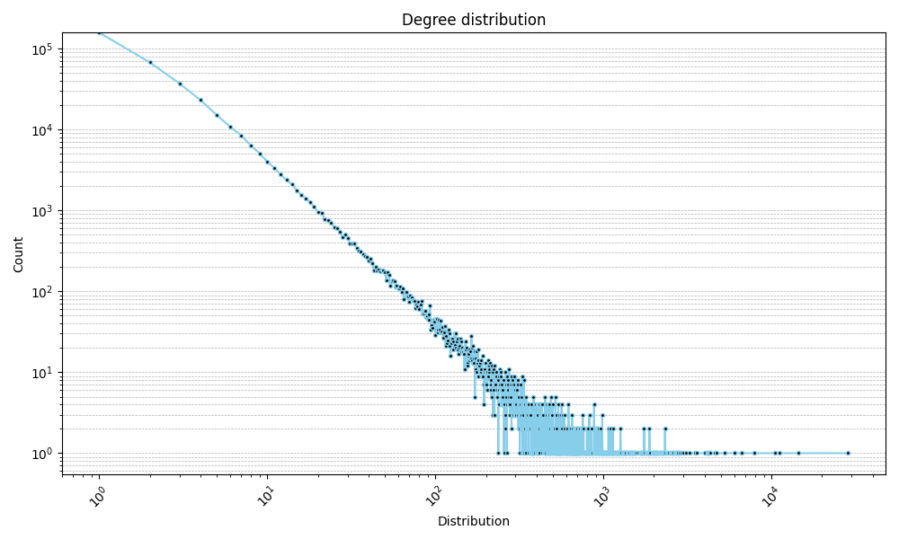
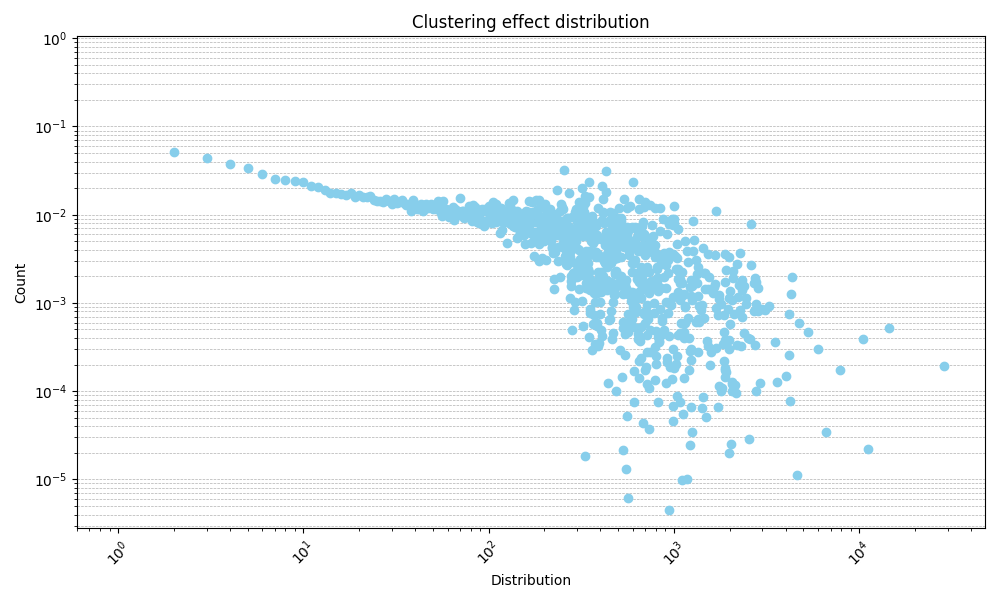

# Report

## Times

- Average degree: 7.9715676988139865 in 1
- Max degree: 28576 in 1
- Degree distribution in 8
- Clustering effect: 8.155038221913898 in 4829
- Clustering distribution in 5080
- Average common neighbors: 8.155038221913898 in 4993
- Maximum common neighbors: 152258 in 4989

## Times par

- Average degree par: 7.9715676988139865 in 122
- Max degree par: 28576 in 92
- Degree distribution par in 141
- Clustering effect par: 8.155038221913898 in 809
- Clustering distribution par in 1074
- Average common neighbors par: 8.155038221913898 in 885
- Maximum common neighbors par: 152258 in 725

## Degree distribution

## Clustering effect

